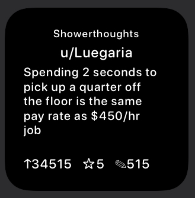
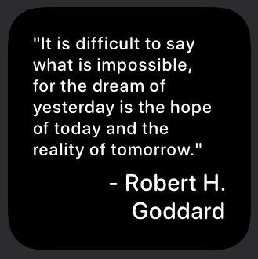
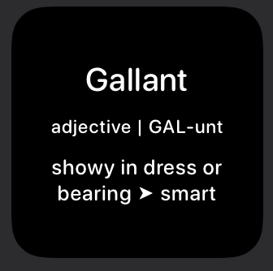
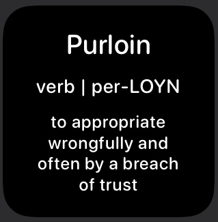
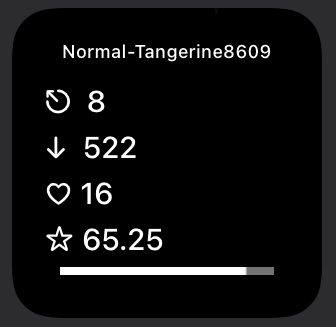
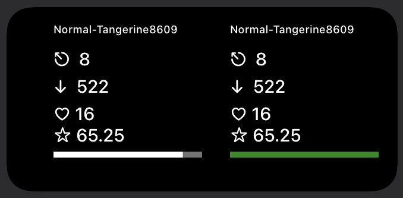
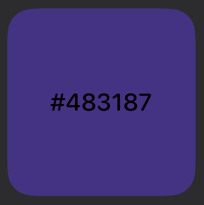
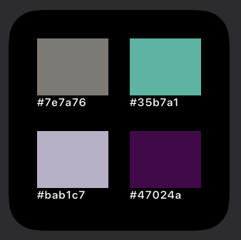

# Scriptable Widgets

Here are all of the scriptable widgets I have made.

***

## Reddit Text Subreddit Widget

[Reddit Text Subreddit Widget](Reddit-Text-Subreddit-Widget.js)

This is a small widget that is meant to showcase a random text post from the subreddit of your choice.

* Can easily change text colours and background colour
* Can choose what text is shown, such as hiding the footer or author name
* Shows the amount of comments, awards and upvotes

## Daily Quote Widget

[Daily Quote Widget](Daily-Quote-Widget.js)

This is a small widget that shows a daily quote and the author. The quote is grabbed from https://www.brainyquote.com/quote_of_the_day.

* Can easily change text colours and background colour
* Different colours can be active if dark mode is on or if light mode is on
* Can choose to show the author or not
* Can change starting text sizes

## Special Days Widget

[Special Days Widget](Special-Days-Widget.js)

This is a small widget that shows today’s special days. The days are grabbed from https://www.daysoftheyear.com/. This widget will display up to 5 special days.

* Can easily change text colours and background colour
* Different colours can be active if dark mode is on or if light mode is on
* Can choose to show the title or not
* Can change starting text sizes

## Word Of The Day Widget

[Word Of The Day Widget](Word-Of-The-Day-Widget.js)

This is a small widget that shows today’s word of the day. The word is grabbed from https://www.merriam-webster.com/word-of-the-day/. The definitions will have a chance not to work. So far all of the words have worked but since all of the definitions are formatted differently they could be a bit messed up. If you see “➤” in a definition than the following word is a synonym of the previous definition.

* Can easily change text colours and background colour
* Different colours can be active if dark mode is on or if light mode is on
* Shows the type of word, pronunciation and syllables, as well as the definition

## Routinehub Stats Widget

[Routinehub Stats Widget](Routinehub-Stats-Widget.js)

[Routinehub Stats Widget Double](Routinehub-Stats-Widget-Double.js)

Both of these widgets display the stats from a Routinehub account. The Routinehub Stats Widget displays the stats of one person in a small or medium widget. The Routinehub Stats Widget Double  displays the stats of two people on a medium widget.

* Can easily change text colours and background colour/gradient
* Can change text sizes and choose to display text instead of the symbols
* Shows the number of shortcuts posted, number of downloads, number of hearts (this might not work for all accounts) and the average downloads per shortcut
* You can set a download goal and there is a progress bar at the bottom of the widget for it
* The progress bar can change colours when it is fully completed

## Random Colour Generator Widget

[Random Colour Generator Widget](Random-Colour-Generator-Widget.js)

This widget has 2 different set ups. The first one is a small widget and will only display one colour and the hex of it. The second widget can be any size and displays multiple colours and their hex values.

* Can easily change text colours and background colour for the multiple colour set up
* Multiple colour set up have 4 colours for small, 8 colours for medium and 16 colours for large

## Clash Royale Chest Cycle Widget

[Clash Royale Chest Cycle Widget](Clash-Royale-Chest-Cycle-Widget.js)

This widget displays your chest cycle visually on your Home Screen.

* Can easily change text colours and background colour
* Can change the approximate time for each widget refresh
* Different colours can be active if dark mode is on or if light mode is on

