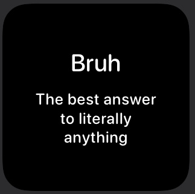

# Scriptable Widgets

Here are all of the scriptable widgets I have made.

- - - -

## Reddit Text Subreddit Widget

[Reddit Text Subreddit Widget](scripts/reddit-text-subreddit-widget.js)

This is a small widget that is meant to showcase a random text post from the subreddit of your choosing.

* Easily change background and text colours
* Choose what text to show, such as hiding the footer or author name
* Shows the amount of comments, awards and upvotes

## Daily Quote Widget

[Daily Quote Widget](scripts/daily-quote-widget.js)

This is a small widget that shows a daily quote and the author. The quote is scrapped from https://www.brainyquote.com/quote_of_the_day.

* Easily change text colours and the background colour
* Colours support dark and light mode changing 
* Choose to show the author or not

## Special Days Widget

[Special Days Widget](scripts/special-days-widget)

This is a small widget that shows today’s special days. The days are scraped from https://www.daysoftheyear.com/. This widget will display up to 5 special days.

* Easily change text colours and the background colour
* Colours support dark and light mode changing

## Word Of The Day Widget

[Word Of The Day Widget](scripts/word-of-the-day.js)

This is a small widget that shows today’s word of the day. The word is scraped from https://www.merriam-webster.com/word-of-the-day/.

* Easily change text colours and the background colour
* Colours support dark and light mode changing 
* Shows the type of word, pronunciation and syllables, as well as the definition

## Urban Dictionary Word Of The Day Widget

[Urban Dictionary Word Of The Day Widget](script/urban-dictionary-word-of-the-day.js)

This small widget displays the word of the day from the Urban Dictionary. Because of this, some of the words could have poor definitions or be NSFW.

* Easily change text colours and the background colour
* Colours support dark and light mode changing 

## On This Day In History

[On This Day In History](scripts/on-this-day-in-history.js)

This small widget displays a random event that happened on this day in history scraped from https://www.onthisday.com/.

* Easily change text colours and the background colour
* Colours support dark and light mode changing 

## Routinehub Stats Widget

[Routinehub Stats Widget](scripts/routinehub-small.js)

[Routinehub Stats Widget Double](scripts/routinehub-medium.js)

Both of these widgets display the stats from a Routinehub account. The Routinehub Stats Widget displays the stats of one person in a small or medium widget. The Routinehub Stats Widget Double  displays the stats of two people on a medium widget.

> This widget is outdated and no longer updated, but still works. The code is terribly written as it was one of my first widgets created.  

* Easily change text colours and background colour/gradient
* Change text sizes and choose to display text instead of the symbols
* Shows the number of shortcuts posted, number of downloads, number of hearts (this might not work for all accounts) and the average downloads per shortcut
* You can set a download goal and there is a progress bar at the bottom of the widget for it
* The progress bar can change colours when it is fully completed

## Random Colour Generator Widget

[Random Colour Generator Widget](scripts/random-colour-generator.js)

This widget has 2 different set ups. The first one is a small widget and will only display one colour and the hex of it. The second widget can be any size and displays multiple colours and their hex values.

* Easily change text colours and background colour for the multiple colour set up
* Multiple colour set up have 4 colours for small, 8 colours for medium and 16 colours for large

