# Scriptable Widgets

Here are all of the scriptable widgets I have made:

* [Reddit Text Subreddit Widget](#reddit-text-subreddit-widget)
* [Daily Quote Widget](#daily-quote-widget)
* [Special Days Widget](#special-days-widget)
* [Word Of The Day Widget](#word-of-the-day-widget)
* [Urban Dictionary Word Of The Day Widget](#urban-dictionary-word-of-the-day-widget)
* [On This Day In History](#on-this-day-in-history)
* [Routinehub Stats Widget](#routinehub-stats-widget)
* [Random Colour Generator Widget](#random-colour-generator-widget)
* [Weather Circles](#weather-circles)
* [MDN Web Api Widget](#mdn-web-api-widget)
* [Can I Use](#can-i-use)
* [Tildes Widget](#tildes-widget)
* [Commander Articles](#commander-articles)

And some scripts:

* [HTML Widget](https://github.com/Normal-Tangerine8609/Scriptable-HTML-Widget)
* [Git Script Download & Update](#git-script-download-and-update)
* [RSS Parser](#rss-parser)
* [Widget Progress Circle](#widget-progress-circle)
* [Simple Calendar](#simple-calendar)
* [Widget Style Chaining](#widget-style-chaining)

Then an article:

* [Scriptable Desktop Developer Environment](#scriptable-desktop-developer-environment)

- - - -

## Widgets

### Reddit Text Subreddit Widget

[Reddit Text Subreddit Widget](widgets/reddit-text-subreddit-widget.js)

This small widget is meant to showcase a random text post from your chosen subreddit.

* Easily change background and text colours
* Choose what text to show, such as hiding the footer or author name
* Shows the amount of comments, awards and upvotes


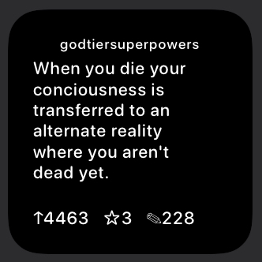

### Daily Quote Widget

[Daily Quote Widget](widgets/daily-quote-widget.js)

This small widget shows a daily quote and the author. The quote is scrapped from https://www.brainyquote.com/quote_of_the_day.

* Easily change text colours and the background colour
* Colours support dark and light mode changing 
* Choose to show the author or not


### Special Days Widget

[Special Days Widget](widgets/special-days-widget.js)

This small widget shows today's special days. The days are scraped from https://www.daysoftheyear.com/. This widget will display up to 5 special days.

* Easily change text colours and the background colour
* Colours support dark and light mode changing


### Word Of The Day Widget

[Word Of The Day Widget](widgets/word-of-the-day.js)

This small widget shows today’s word of the day. The word is scraped from https://www.merriam-webster.com/word-of-the-day/.

* Easily change text colours and the background colour
* Colours support dark and light mode changing 
* Shows the type of word, pronunciation and syllables, as well as the definition

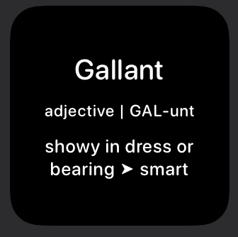

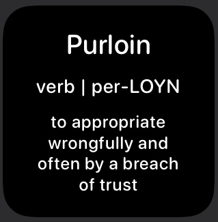

### Urban Dictionary Word Of The Day Widget

[Urban Dictionary Word Of The Day Widget](widgets/urban-dictionary-word-of-the-day.js)

This small widget displays the word of the day from the Urban Dictionary. Because of this, some of the words could have poor definitions or be NSFW.

* Easily change text colours and the background colour
* Colours support dark and light mode changing 


### On This Day In History

[On This Day In History](widgets/on-this-day-in-history.js)

This small widget displays a random event that happened on this day in history scraped from https://www.onthisday.com/.

* Easily change text colours and the background colour
* Colours support dark and light mode changing 


### Routinehub Stats Widget

[Routinehub Stats Widget](widgets/routinehub-small.js)

[Routinehub Stats Widget Double](widgets/routinehub-medium.js)

Both of these widgets display the stats from a Routinehub account. The Routinehub Stats Widget displays one person's stats in a small or medium widget. The Routinehub Stats Widget Double displays two people's stats on a medium widget.

> [!WARNING]
> This widget is outdated and no longer updated.

* Easily change text colours and background colour/gradient
* Change text sizes and choose to display text instead of the symbols
* Shows the number of shortcuts posted, number of downloads, number of hearts (this might not work for all accounts) and the average downloads per shortcut
* You can set a download goal, and there is a progress bar at the bottom of the widget for it
* The progress bar can change colours when it is fully completed

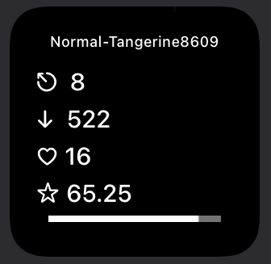


### Random Colour Generator Widget

[Random Colour Generator Widget](widgets/random-colour-generator.js)

This widget has two different setups. The first one is a small widget and will only display one colour and the hex of it. The second widget can be any size, displaying multiple colours and their hex values.

* Easily change text and background colours for the multiple-colour setup
* Multiple-colour set up has four colours for small, eight colours for medium, and 16 colours for large

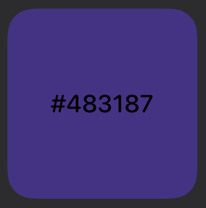

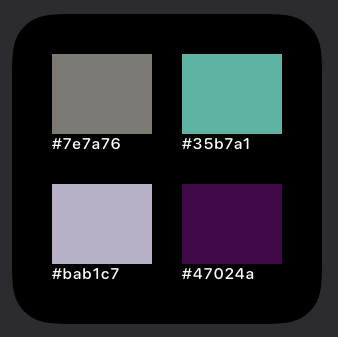

### Weather Circles

[Weather Circles](widgets/weather-circles.js)

> [!WARNING]  
> This script no longer works because of changes in Open Weather Map unless you have an older API key.

This small widget displays your location's weather conditions and weather statistics in circular progress bars. This widget uses https://github.com/Normal-Tangerine8609/Scriptable-HTML-Widget to create the widget and https://openweathermap.org/ to get the weather data (you will need a free API key but it may not work with the latest api keys).

* Easily change text, background, circular progress bar and SF symbol colours
* Colours support dark and light mode changing 
* Select the latitude and longitude for your location and choose to use metric or imperial data
* Change minimum and maximum levels of temperature and other types of weather provided to gear the percentages to you
* Easily change the order of circular progress bars and the interior symbols

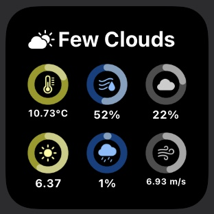

### MDN Web Api Widget

[MDN Web Api](widgets/mdn-web-api.js)

This small or medium widget displays a random web API from the MDN [list](https://developer.mozilla.org/en-US/docs/Web/API).

* Easily change theme colours and SF symbols
* Colours support dark and light mode changing
* Catch the web API data for reuse if not connected to data

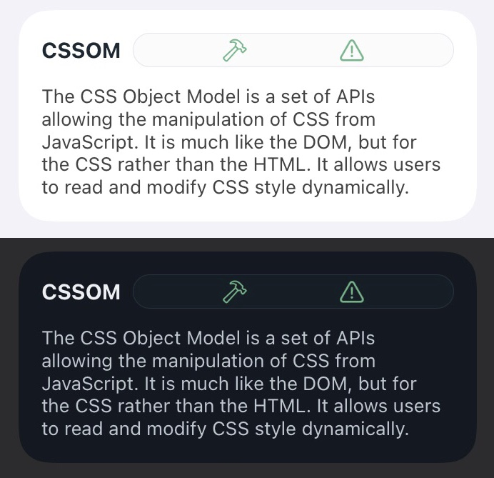

### Can I Use

[Can I Use](widgets/can-i-use.js)

This Lock Screen and Home Screen widget displays the latest browser support data from [caniuse.com](https://caniuse.com/).

* Easily change theme colours
* Colours support dark and light mode changing
* Choose what stats you want to view using the widget parameters

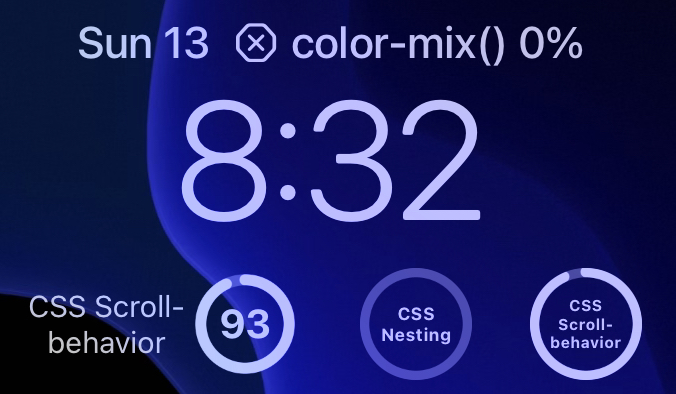
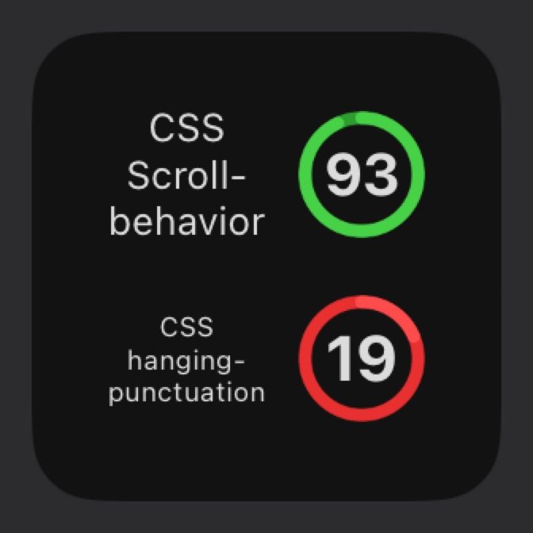

### Tildes Widget

[Tildes Widget](widgets/tildes-widget.js)

This small widget displays recent posts from [tildes.net](https://tildes.net/).

* Easily change theme colours
* Choose sizing variables
* Choose what posts you want to view using the widget parameters

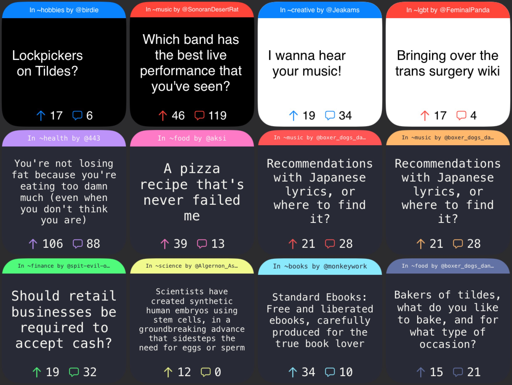

### Commander Articles

[Commander Articles](widgets/commander-articles.js)

This small or medium widget displays recent articles from [EDHREC](https://edhrec.com) or [Commander's Herald](https://commandersherald.com/).

* Easily change theme colours
* Choose your preferred website to view articles from
* Highlight articles you follow

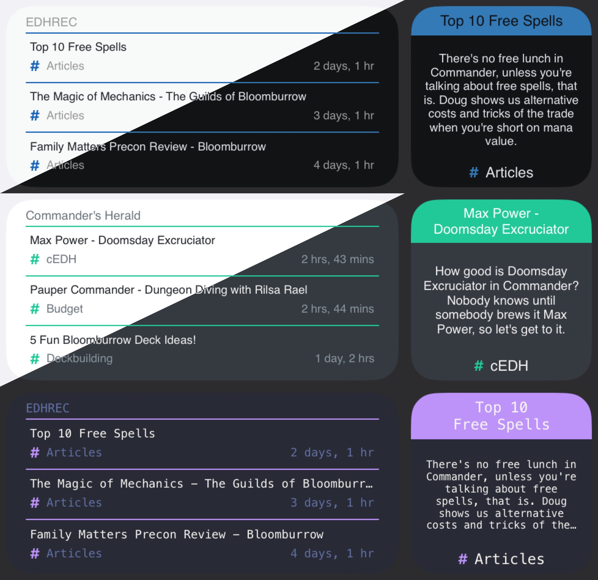

## Scripts

### HTML Widget

[HTML Widget](https://github.com/Normal-Tangerine8609/Scriptable-HTML-Widget)

This script allows you to create widgets using an HTML-like syntax. Here is an example of the code and widget image for a Reddit widget.

<details>
  <summary>Reveal Code</summary>

```javascript
const htmlWidget = importModule("html-widget")
const symbol = importModule("html-widget-symbol")
const addons = {symbol}

let json = await new Request("https://www.reddit.com/r/Showerthoughts.json").loadJSON()
let post = json["data"]["children"][Math.floor((Math.random() * 10) + 2)]["data"]
let title = post["title"].replace(/</g,"<").replace(/>/g,">")
let body = post["selftext"].replace(/</g,"<").replace(/>/g,">")
let ups = post["ups"]
let awards = post["all_awardings"].length
let comments = post["num_comments"]
let url = post["url"]

let widget = await htmlWidget(`
<widget refresh-after-date="15" url="${url}">
  <style>
    symbol {
      image-size: 11,11;
    }
    .title {
      font: system-ui, 13;
      align-text: center;
    }
    .content {
      font: system-ui, 11;
      minimum-scale-factor: 0.3;
    }
  </style>
  <text class="title">Showerthoughts</text>
  <spacer space="5"/>
  <text class="content">${title}</text>
  <text class="content">${body}</text>
  <stack align-content="center">
    <symbol>arrow.up.circle.fill</symbol>
    <spacer space="2"/>
    <text class="content">${ups}</text>
    <spacer/>
    <symbol>star.circle.fill</symbol>
    <spacer space="2"/>
    <text class="content">${awards}</text>
    <spacer/>
    <symbol>message.circle.fill</symbol>
    <spacer space="2"/>
    <text class="content">${comments}</text>
  </stack>
</widget>
`, true, addons)

Script.setWidget(widget)
widget.presentSmall()
Script.complete()
```

</details>

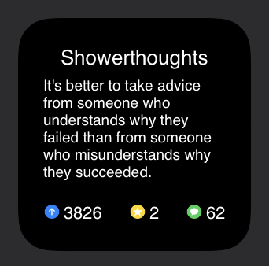

### Git Script Download And Update

[Git Script Download & Update](scripts/git-script-download-update/README.md)

This script tracks downloaded scriptable scripts from Git Hub and updates them.

* Small widget and Lock Screen widgets
* Easy to use
* Works from Sharesheet or scriptable

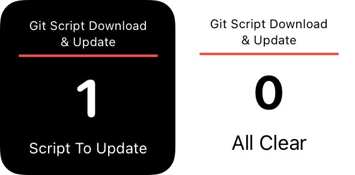

### RSS Parser

[RSS Parser](scripts/rss-parser.js)

This script parses RSS feeds into usable content for widgets.

* Small in size
* Works with [all](https://github.com/plenaryapp/awesome-rss-feeds) RSS feeds

### Widget Progress Circle

[Widget Progress Circle](scripts/widget-progress-circle.js)

This script is a function that creates a circular progress bar that can have ant widget elements within.

* Can change sizes
* Supports dark and light mode colours
* Can put any element within the circle

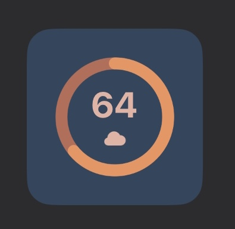

### Simple Calendar

[Simple Calendar](scripts/simple-calendar.js)

This script is a boilerplate for a simple calendar widget

* Customizable
* Inline documentation to explain processes
* Extendable

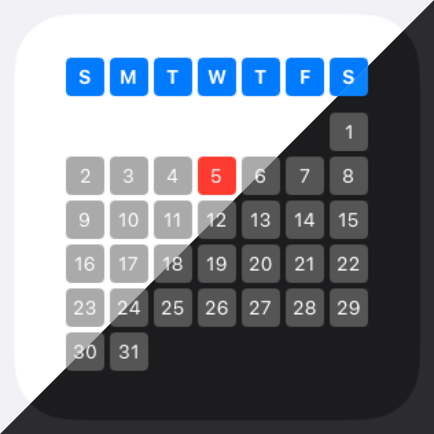

### Widget Style Chaining

[Widget Style Chaining](scripts/chaining.js)

This script allows you to chain properties for widget-building. For example, previously, you would need to do:

```js
const widget = new ListWidget()

const title = widget.addText("The Title")
title.centerAlignText()
title.font = Font.regularSystemFont(16)
title.minimumScaleFactor = 0.6
title.textColor = Color.blue()

widget.presentSmall()
```

And now you can type:

```js
const widget = createChainWidget()

widget.addText("The Title")
  .centerAlignText()
  .font(Font.regularSystemFont(16))
  .minimumScaleFactor(0.6)
  .textColor(Color.blue())

widget.presentSmall()
```


## Scriptable Desktop Developer Environment

* Set up your desktop for developing Scriptable scripts and widgets in your favourite text editor with JavaScript or TypeScript.

Read [here](https://brettormsby.github.io/Portfolio/posts/scriptable-desktop-developer-environment/)!
